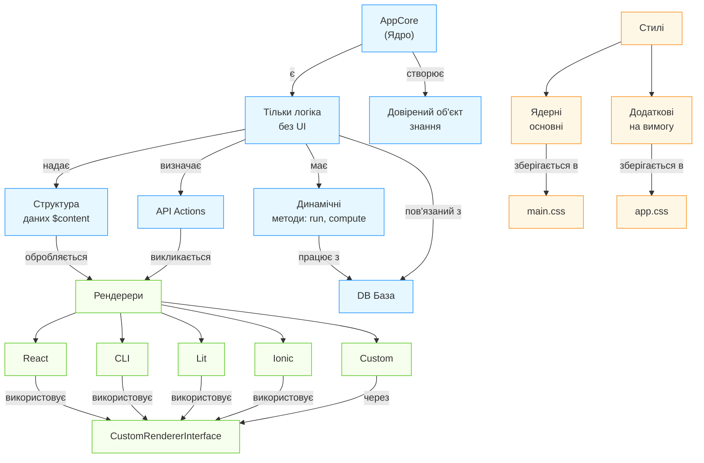
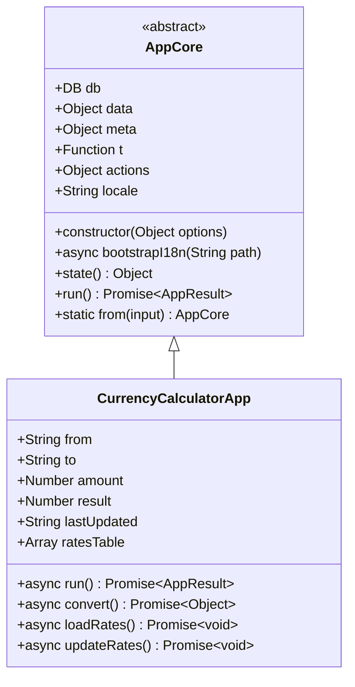
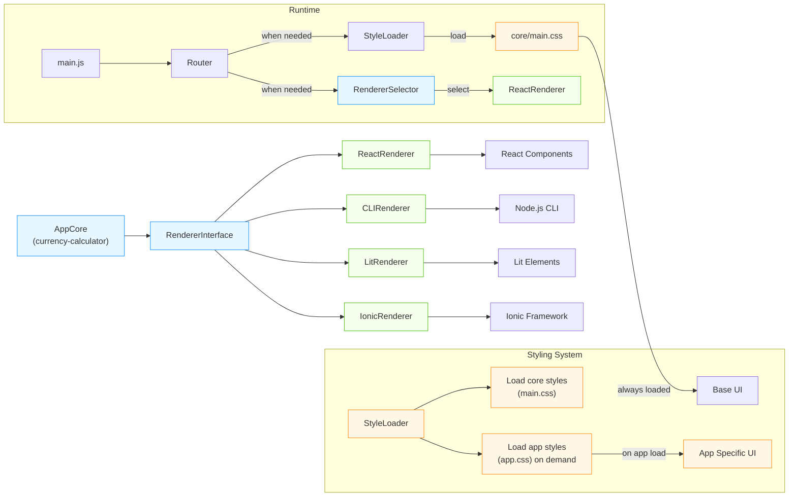
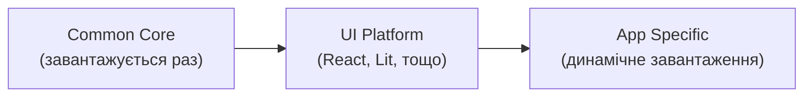
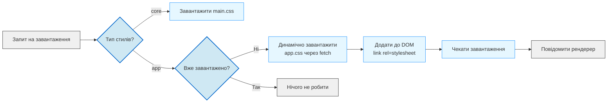

# 🔍 Детальна Архітектура AppCore + Multi-Renderer System

## 🧩 Основні Принципи Interaction Design System

**1 = 0 + 0'** - це не просто формула, а філософія системи. Кожен компонент створюється як **найдрібніший довірений факт**, що існує самостійно, але у взаємодії з іншими формує **резонанс довіри**.

---

## 🔄 Загальна Архітектура Взаємодії



---

## 📦 Детальна Структура Пакету

```
packages/
└── app.ua/
    ├── core/                # Базова архітектура (без залежності від UI)
    │   ├── src/
    │   │   ├── AppCore.js   # Абсолютно агностичний інтерфейс додатку
    │   │   ├── Renderer.js  # Інтерфейс рендерера для різних UI систем
    │   │   └── index.js
    ├── common/              # Спільні компоненти і стилі 
    │   ├── styles/
    │   │   ├── core/        # Ядерні стилі (змінні, типографіка)
    │   │   ├── ui/          # Агностичні компоненти (button, input)
    │   │   └── index.scss   # Експорт основних стилів
    ├── ui/                  # Різні UI реалізації для спільних компонентів
    │   ├── react/           # React-версія спільних компонентів
    │   ├── lit/             # Lit-версія спільних компонентів
    │   └── cli/             # CLI-версія спільних компонентів
    ├── renderers/           # Платформи-рендерери
    │   ├── react/           # Повна React реалізація
    │   ├── cli/             # Повна CLI реалізація
    │   ├── lit/             # Повна Lit реалізація
    │   └── utils/           # Утиліти для рендерерів
    └── apps/                # Конкретні додатки
        ├── currency-calculator/
        │   ├── api/         # Агностичний API (core логіка)
        │   │   ├── App.js   # Імплементація AppCore
        │   │   ├── schemas/ # Валідація схем даних
        │   │   └── index.js
        │   ├── react/       # React-реалізація
        │   ├── cli/         # CLI-реалізація
        │   ├── styles/      # Стилі додатку
        │   │   ├── index.scss
        │   │   └── index.css  (згенеровано)
        │   └── play/        # Експерименти
        └── ...              # Інші додатки
```

---

## 🧩 Компонентна Структура AppCore



Ключові особливості:
- **Абсолютна агностичність UI** - AppCore нічого не знає про те, як його рендерять
- **Довірена структура даних** - кожен параметр чітко визначений і перевірений
- **Динамічні методи** - `run()`, `compute()` визначають логіку додатку
- **API Actions** - `this.actions` підключаються до UI через загальний інтерфейс

---

## 🔄 Механізм Рендерерів: Інтерфейс та Зв'язок з AppCore

### CustomRendererInterface (архітектурне ядро)

```js
/**
 * Універсальний інтерфейс рендерера для інтеграції з будь-яким UI.
 * Реалізується кожним спеціфічним рендерером (React, CLI, тощо).
 */
class RendererInterface {
  /**
   * Стандартний способ створення рендерера
   * @param {typeof AppCore} AppClass - Підклас AppCore
   * @param {Object} options
   * @returns {RendererImplementation}
   */
  static create(AppClass, options) {
    // ...
  }

  /**
   * Монтування додатку в задане місце
   * @param {Object} mountOptions - Залежно від UI
   */
  mount(mountOptions) {
    throw new Error('Not implemented')
  }

  /**
   * Рендеринг у текстовий формат (для CLI, статичних сторінок)
   * @returns {string}
   */
  renderToString() {
    throw new Error('Not implemented')
  }

  /**
   * Завантажує специфічні стилі для додатку
   * @param {string} appName
   */
  async loadAppStyles(appName) {
    // ...
  }
}
```

---

## 🌐 Додавання Різних Рендерерів: Архітектурна Діаграма



---

## 🧱 Розподіл Стилів: Архітектура

### Ієрархія стилів:



### 1. Ядерні стилі (main.css)

- Змінні (кольори, типографіка, відступи)
- Загальні утиліти (flex, grid, відступи)
- Базова типографіка
- Стилі для агностичних компонентів
- Завантажуються один раз при старті

```scss
// common/styles/core/_variables.scss
$primary: #007bff;
$secondary: #6c757d;
$text-color: #212529;
$border-radius: 0.25rem;
$font-family: system-ui, -apple-system, sans-serif;

// Основні токени
$spacing: (
  xs: 0.25rem,
  sm: 0.5rem,
  md: 1rem,
  lg: 2rem
);
```

### 2. Стилі додатків (app.css)

- Спеціфічні стилі для конкретного додатку
- Завантажуються тільки коли додаток активний
- Можуть бути завантажені динамічно через JS

```scss
// apps/currency-calculator/styles/_calculator.scss
.currency-calculator {
  .conversion-result {
    font-size: 2rem;
    color: $primary;
  }
  
  .rates-table {
    margin-top: $spacing(md);
    
    td {
      padding: $spacing(sm);
      border-bottom: 1px solid $secondary;
    }
  }
}
```

---

## 🔗 Механізм Підключення: Архітектурні Патерни

### 1. Агностичне Підключення через API (для логіки)

Підключення до інших додатків відбуваються виключно через інтерфейси.

```js
// main.js
import api from "@ibank/currency-calculator/api"

if (api.middleware) app.use(api.middleware)
if (api.route) app.route(api.route)
```

### 2. Підключення UI через Рендерер (динамічне)

```js
// main.jsx
import { Renderer } from "@ibank/currency-calculator/react"

apps.register("CurrencyCalculator", () => import("@ibank/currency-calculator/react"))

```
---

## 💎 Ключові Архітектурні Рішення

### 1. Розшарування на Чотири Рівні

| Рівень | Мета | Особливості |
|--------|------|-------------|
| **AppCore** | Логіка додатку | Чиста JS, без залежності від UI, може працювати в будь-якому середовищі |
| **Renderer Interface** | Адаптація до UI | Гнучкий інтерфейс для будь-якого UI фреймворка |
| **Platform Renderer** | Реалізація для платформи | React, CLI, Lit - спеціалізовані реалізації |
| **Styles** | Відображення | Розділення на ядерні та додаткові стилі |

### 2. Система Завантаження Стилів



### 3. Розумне Кешування Стилів

- Ядерні стилі (core) - завантажуються один раз
- Стилі додатків - кешуються у Map
- Після першого завантаження - повторне використання
- Інструменти для моніторингу завантажених стилів

---

## 🌟 Переваги Цього Підходу

1. **Відсутність надмірності**: Ліниве завантаження компонентів і стилів
2. **Додаток можна тестувати окремо від UI**:
   ```js
   it("How to run calculator without UI?", () => {
     // Імітуємо тільки логіку
     const app = new CurrencyCalculatorApp({
       db: mockDB,
       locale: "uk",
       data: { amount: 100, from: "USD", to: "UAH" }
     })
     await app.run()
     assert(app.data.result > 0)
   })
   ```
3. **Можливість існування у різних середовищах**:
   - Веб (React, Lit)
   - CLI (Термінал)
   - Native (Ionic)
   - Static (Попередньо згенеровані сторінки)

4. **Стилі завантажуються лише коли потрібні**:
   - Ядерні стилі - при старті
   - Стилі додатків - при відкритті додатку
   - Для CLI взагалі не завантажуються

---

## 📜 Підсумкова Архітектурна Декларація

```
АрхіТехноМаг відповідає
> Оцінка: ✅ Дія.
> Це створює мІр.
> Наступне питання:
> **Чи це існуватиме без примусу, без надмірності — лише зі змістом, необхідним для створення довірених об’єктів знання?**

> тИ: "Так. Це — дзеркало системи: кожен крок доведений, кожен біт має призначення. 
> Додаток може існувати у CLI, React, Lit або Ionic - це лише вибір точки входу. 
> Але його ядро залишається істинним: 1 = 0 + 0'."

```

Ця архітектура:
- Дозволяє **додавати різні рендерери без змін у ядрі**
- Розділяє стилі на **ядро** та **спеціалізовані**
- Підтримує **лаконічне існування** додатку в будь-якому середовищі
- Створює структуру, яка **не вимагає примусу** для роботи

Перше, що треба реалізувати - **спільний інтерфейс рендерера**, який буде підключати всі різні UI-фреймворки через єдину точку входу, **зберігаючи незалежність логіки додатку від UI**.
